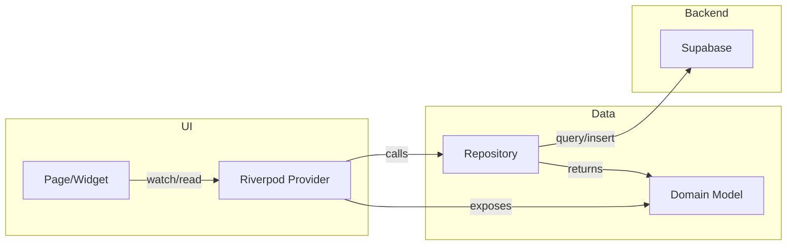
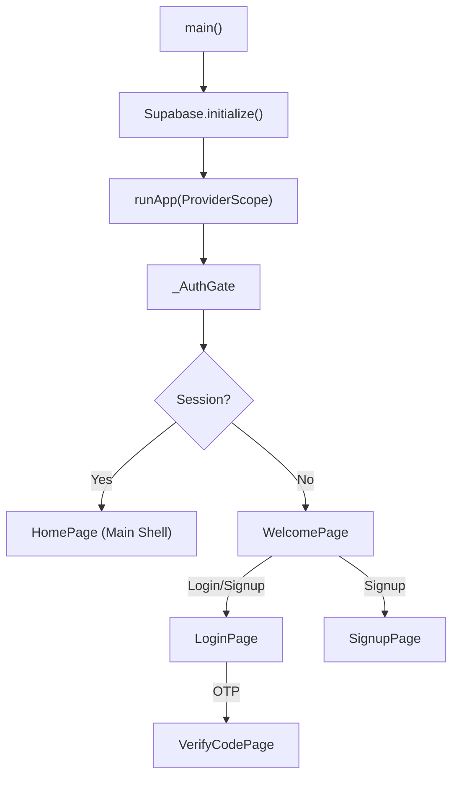
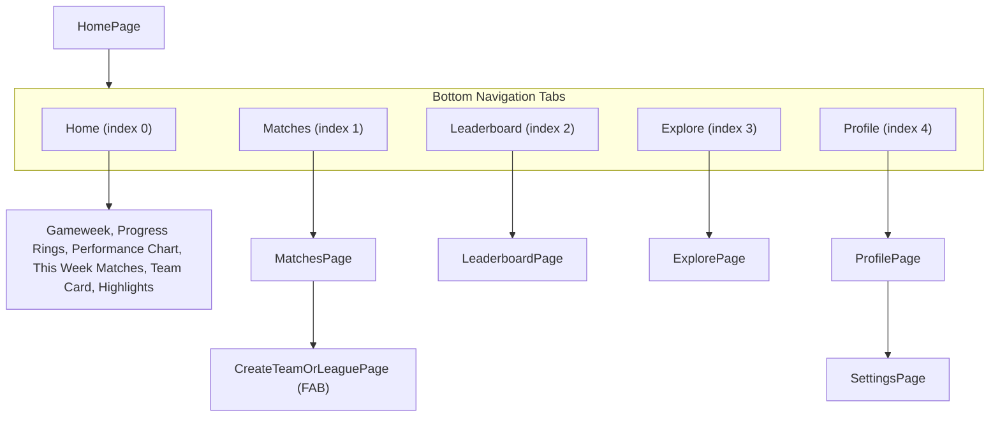

# FootyStats App – Architectural Structure Diagram

This document describes the high-level architecture of the FootyStats Flutter app.

---

## Overview

FootyStats is a Flutter app that uses **Riverpod** for state management and **Supabase** as the backend (auth + PostgreSQL). The architecture follows a layered approach: **Presentation → Domain → Data**.

---

## Layer Diagram (Mermaid)

```mermaid
flowchart TB
    subgraph Presentation["📱 Presentation Layer"]
        subgraph Pages["Pages"]
            WelcomePage["WelcomePage"]
            LoginPage["LoginPage"]
            SignupPage["SignupPage"]
            VerifyCodePage["VerifyCodePage"]
            HomePage["HomePage"]
            MatchesPage["MatchesPage"]
            LeaderboardPage["LeaderboardPage"]
            ExplorePage["ExplorePage"]
            ProfilePage["ProfilePage"]
            FixturePage["FixturePage"]
            LeagueDetailPage["LeagueDetailPage"]
            LeagueAddTeamsPage["LeagueAddTeamsPage"]
            LeagueCreateMatchesPage["LeagueCreateMatchesPage"]
            LeagueApplicationsPage["LeagueApplicationsPage"]
            CreateTeamOrLeaguePage["CreateTeamOrLeaguePage"]
            TeamDetailPage["TeamDetailPage"]
            SettingsPage["SettingsPage"]
            PlayerNamePage["PlayerNamePage"]
            UsernamePage["UsernamePage"]
        end
        
        subgraph Widgets["Widgets"]
            MatchCard["MatchCard"]
            MatchListItem["MatchListItem"]
            GameweekHeader["GameweekHeader"]
            TeamChip["TeamChip"]
            ChallengeWidget["ChallengeWidget"]
            PerformanceChart["PerformanceChart"]
            ProgressRing["ProgressRing"]
        end
        
        subgraph Providers["Providers (Riverpod)"]
            MatchesProvider["matchesProvider"]
            LeaguesProvider["leaguesProvider"]
            TeamsProvider["teamsProvider"]
            SeasonsProvider["seasonsProvider"]
            LeagueTeamsProvider["leagueTeamsProvider"]
            LeagueApplicationsProvider["leagueApplicationsProvider"]
            HomeProvider["home_provider"]
            NavigationProvider["navigation_provider"]
        end
    end
    
    subgraph Domain["📦 Domain Layer"]
        subgraph Models["Models"]
            MatchModel["MatchModel"]
            TeamModel["TeamModel"]
            LeagueModel["LeagueModel"]
            LeagueTeamModel["LeagueTeamModel"]
            LeagueApplicationModel["LeagueApplicationModel"]
            SeasonModel["SeasonModel"]
            UserProfile["UserProfile"]
        end
    end
    
    subgraph Data["🗄️ Data Layer"]
        subgraph Repositories["Repositories"]
            MatchesRepository["MatchesRepository"]
            LeaguesRepository["LeaguesRepository"]
            TeamsRepository["TeamsRepository"]
            SeasonsRepository["SeasonsRepository"]
            LeagueTeamsRepository["LeagueTeamsRepository"]
            LeagueApplicationsRepository["LeagueApplicationsRepository"]
            UserProfileRepository["UserProfileRepository"]
        end
        
        subgraph DataSources["Data Sources"]
            SupabaseClient["Supabase Client"]
        end
    end
    
    subgraph Core["🔧 Core"]
        Theme["Theme"]
        Constants["app_constants, app_assets"]
        Utils["util.dart"]
        SharedWidgets["progress_ring, etc."]
    end
    
    subgraph External["☁️ External"]
        Supabase["Supabase"]
    end
    
    Pages --> Providers
    Widgets --> Providers
    Providers --> Repositories
    Repositories --> Models
    Repositories --> SupabaseClient
    SupabaseClient --> Supabase
    Pages --> Core
    Widgets --> Core
```



---

## Data Flow Diagram



---

## App Entry & Auth Flow



---

## Main Shell (HomePage) Structure



---

## Repository ↔ Supabase Mapping

| Repository | Supabase Table(s) |
|------------|-------------------|
| `MatchesRepository` | `matches`, `teams`, `leagues`, `gameweeks` |
| `LeaguesRepository` | `leagues` |
| `TeamsRepository` | `teams` |
| `SeaguesRepository` | `seasons` |
| `LeagueTeamsRepository` | `league_teams` |
| `LeagueApplicationsRepository` | `league_applications` |
| `UserProfileRepository` | `players`, `auth.users` |

---

## Provider Dependencies

| Provider | Repository | Purpose |
|----------|------------|---------|
| `matchesRepositoryProvider` | MatchesRepository | All matches |
| `matchesProvider` | MatchesRepository | Match list (with gameweek filter) |
| `homeThisWeekMatchesProvider` | MatchesRepository | Matches this week |
| `fixtureMatchProvider` | MatchesRepository | Single match by ID |
| `matchesGroupedByDateProvider` | matchesProvider | Matches grouped by date |
| `matchClockProvider` | — | Match stopwatch state |
| `leaguesProvider` | LeaguesRepository | Leagues list |
| `teamsProvider` | TeamsRepository | Teams list |
| `seasonsProvider` | SeasonsRepository | Seasons list |
| `leagueTeamsProvider` | LeagueTeamsRepository | Teams in a league |
| `leagueApplicationsProvider` | LeagueApplicationsRepository | League applications |

---

## Folder Structure

```
footystats/lib/
├── main.dart                 # Entry point, Supabase init, AuthGate
├── core/                     # Shared infrastructure
│   ├── constants/            # app_constants.dart, app_assets.dart
│   ├── theme/                # theme.dart
│   ├── utils/                # util.dart
│   └── widgets/              # progress_ring.dart, etc.
├── domain/
│   └── models/               # Pure data models
│       ├── match_model.dart
│       ├── team_model.dart
│       ├── league_model.dart
│       ├── league_team_model.dart
│       ├── league_application_model.dart
│       ├── season_model.dart
│       └── user_profile.dart
├── data/
│   ├── datasources/
│   │   └── remote/
│   │       └── supabase_client.dart
│   └── repositories/
│       ├── matches_repository.dart
│       ├── leagues_repository.dart
│       ├── teams_repository.dart
│       ├── seasons_repository.dart
│       ├── league_teams_repository.dart
│       ├── league_applications_repository.dart
│       └── user_profile_repository.dart
└── presentation/
    ├── pages/                # Full screens
    ├── widgets/              # Reusable UI components
    │   └── home/             # Home-specific widgets
    └── providers/            # Riverpod providers
```

---

## Tech Stack Summary

| Concern | Technology |
|---------|------------|
| Framework | Flutter |
| State Management | Riverpod (flutter_riverpod) |
| Backend / Auth | Supabase |
| HTTP / DB | Supabase Client (PostgreSQL) |
| Charts | fl_chart |
| Fonts | google_fonts |
| Icons/Images | flutter_svg, image_picker |

---

## Simplified Block Diagram

```
┌─────────────────────────────────────────────────────────────────────┐
│                         FOOTYSTATS APP                               │
├─────────────────────────────────────────────────────────────────────┤
│  PRESENTATION                                                        │
│  ┌─────────────┐  ┌─────────────┐  ┌─────────────────────────────┐  │
│  │   Pages     │  │   Widgets   │  │  Riverpod Providers         │  │
│  │ (Screens)   │  │ (Reusable)  │  │  (State Management)         │  │
│  └──────┬──────┘  └──────┬──────┘  └──────────────┬──────────────┘  │
│         │                │                        │                  │
│         └────────────────┴────────────────────────┘                  │
│                                  │                                   │
├──────────────────────────────────┼───────────────────────────────────┤
│  DOMAIN                          │                                   │
│  ┌───────────────────────────────▼───────────────────────────────┐   │
│  │  Models: Match, Team, League, Season, UserProfile, etc.        │   │
│  └───────────────────────────────┬───────────────────────────────┘   │
├──────────────────────────────────┼───────────────────────────────────┤
│  DATA                            │                                   │
│  ┌───────────────────────────────▼───────────────────────────────┐   │
│  │  Repositories: Matches, Leagues, Teams, Seasons, etc.          │   │
│  └───────────────────────────────┬───────────────────────────────┘   │
│                                  │                                   │
├──────────────────────────────────┼───────────────────────────────────┤
│  EXTERNAL                        │                                   │
│  ┌───────────────────────────────▼───────────────────────────────┐   │
│  │  Supabase (Auth + PostgreSQL)                                 │   │
│  └───────────────────────────────────────────────────────────────┘   │
└─────────────────────────────────────────────────────────────────────┘
```
